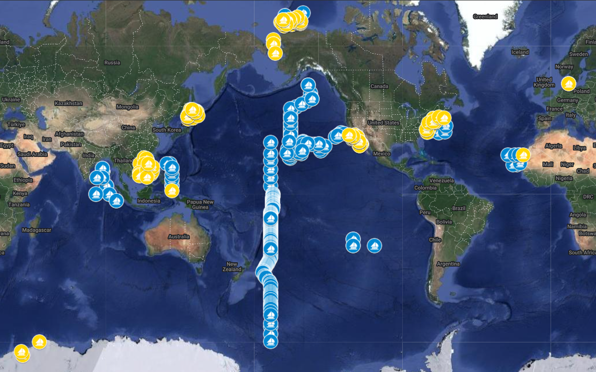

# Workflow for processing nifH amplicon data sets

This repository contains all post-pipeline software stages and data deliverables described in Morando, Magasin et al. 2023.  The workflow was used to process nearly all _nifH_ amplicon data sets (MiSeq) that existed at the time of publication. The samples are shown in this map which links to an interactive Google map with study names, sample IDs, and collection information for each sample.

## Workflow overview
The following figure shows the workflow:

DADA2 ASVs were created by the pipeline (in green; repository [here](https://github.com/jdmagasin/nifH_amplicons_DADA2)). Post-pipeline stages (orange), each executed by a Makefile, were used to gather the ASVs from all studies, filter them for quality, and annotate them.  The two main data resources generated by the workflow, the _nifH_ ASV database and the nifH ASV catalog, will support future research in to nitrogen-fixing marine microbes.
